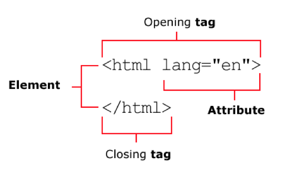

# HTML elements, tags and attributes



## Elements and tags

- HTML elements are the building blocks of HTML pages.
- An element usually has a start and end tag, an opening and closing tag.
- For example: `<p>` and `</p>`.
- A start tag starts with `<` and ends with `>`.  
- An end tag starts with `<` and ends with `/>`.
- Tags have names, for example the name of the `<p>' tag is `p`.
- Not all tags have closing tags. For example: `<br>`, a break, or a new line. Another example: ``.

## Attributes

- Some elements have attributes.
- Attributes are used to give extra info to an element.
- For example: ``. The `` element requires a `src` (source) attribute to let the browser know which image to load.
- Attribute always have the form `name="value"`. You can also use single quotes, but double quotes is more common.
- Attributes always appear at the start tag, never at the end tag.
- Some attributes are required, while others are optional. For example: the `src` attribute is required for an `` tag. The `width` attribute for an `` is optional.
- An element can have multiple attribute, seperated by a space. The order is never important. For example: ``.

# Basic structure of an HTML document

The is a minimal HTML page:

```html
<!DOCTYPE html>     
<html lang="en">
    <head>
        <meta charset="utf-8">
        <title>This is the title</title>
    </head>
    <body>
        <h1>Hello world!</h1>
    </body>
</html>
```

## Doctype

- Necessary, but no need to worry about the details.
- Must be on the first line.
- Mostly needed for historical reasons.

## `<html>`

- The `<html>` element is the container for the whole page.
- An HTML document contains HTML elements.
- There is a hierarchical relationship between the elements.
- The `<html>` element is at the top of hierarchy.
- It has two child elements: `<head>` and `<body>`.
- These are required. In other parts of the document you are free to include other elements, but inside `<html>` we need to use `<head>` and `<body>`.
- Always set the `lang` attribute of the `<html>` element so search engines and other software know what language your document is in. 

## `<head>`

- The `<head>` element contains meta information, meaning info about the document itself.
- Most important: the `<title>` of the document.
- The title appears in the title bar of the browser window, and is used when you save a bookmark, or save the page. 
- It's also very important for search engines. The title is used in the search results. Also, search engine will use the text of the `<title>` to rank search results. It's very important for SEO to give good titles to pages, and to make them unique.
- Other things that can appear in the `<head>` element: the character set used, references to stylesheets, reference to the favicon, ...

## `<body>`

- The `<body>` element contains the actual content: text, images, ...

# Commonly used HTML elements

## Headings

- `<h1>`, `<h2>`, `<h3>`, `<h4>`, `<h5>`, `<h6>`
- `<h1>` = most important title
- `<h2>` = subtitle
- Use headings to indicate the logical levels in your text.

## Paragraphs and breaks

- `<p>This is a paragraph.<p>`
-  Use a break `<br>` to create a new line in a paragraph.
- Paragraph are block level elements.

## Lists

- Very common. Also used for navigation items.
- Can be ordered (with a numbering) and unordered (no numbering).
- Lists are block level elements.

Unordered:

```html
<ol>
    <li>cookies</li>
    <li>milk</li>
    <li>bread</li>
</ol>
```

Ordered:

```html
<ul>
    <li>cookies</li>
    <li>milk</li>
    <li>bread</li>
</ul>
```

## Images

- ``````
- The `src` attribute is required.
- Use relative paths for loading images within your website and absolute paths to link to an image on another website.
- `alt` attribute: a textual description of the image
- You can omit the description within the `alt` attribute if the image you are using is decorative and has no 'real meaning', for example a drop shadow, a separator, ...
- Images are inline level elements.

## Links
- `<a href="path_to_link">content that is looks like a  link</a>`
- The `href` attribute is required.
- Use relative paths for linking files within your website and absolute path to link  to external resources and websites.
- `<a href="path_to_link" target="_blank">` 
- Use the attribute `target="_blank"` when linking to an external website to keep your website and let the link open in a new tab or page.
- Links are inline level elements, so you can place a link within paragraphs, headers, lists, or structural elements.

## Comments

- `<!-- some comment  -->`
- Used for your own organisation. 
- Used to temporarily hide your markup in the browser (in debug mode).

## Entities

- Some characters have a special meaning.
- For example `<` is the start of the tag.
- We cannot use these characters directly because we would confuse the browser. We need to use 'entities'.

Common entities:

- `&gt;` for `>`
- `&lt;` for `<`
- `&amp;` for `&`

## Text formatting

- `<b>`, `<strong>`
- `<i>`, `<em>`
- `<hr>`

## Structual elements

- `<header>`, `<footer>`
- `<nav>`

  
